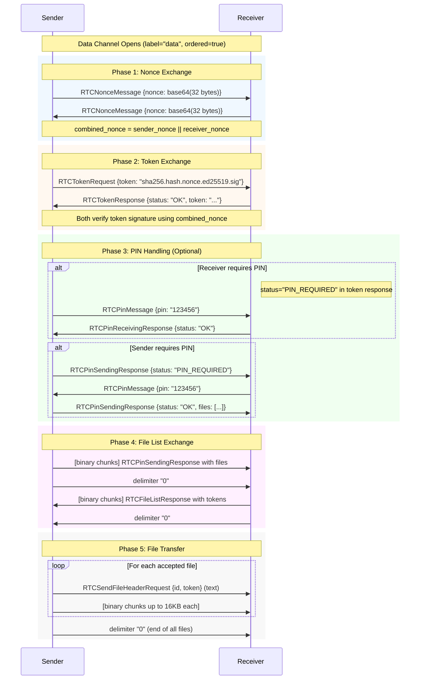

# LocalSend Protocol v3 (Unofficial)

Based on the official Rust implementation at [localsend/core](https://github.com/localsend/localsend).

> [!NOTE]
> This specification extends [Protocol v2.1](./localsend_protocol_v2_1.md) with WebRTC support and HTTP v3 endpoints. The v2.1 protocol remains valid for legacy/LAN-only communication.

---

## Table of Contents

- [1. Overview](#1-overview)
- [2. Changes from v2.1](#2-changes-from-v21)
- [3. Infrastructure](#3-infrastructure)
  - [3.1 Default Ports and Addresses](#31-default-ports-and-addresses)
  - [3.2 Public Signaling Server](#32-public-signaling-server)
  - [3.3 STUN Servers](#33-stun-servers)
- [4. Cryptographic Primitives](#4-cryptographic-primitives)
  - [4.1 Base64 Encoding](#41-base64-encoding)
  - [4.2 Nonce Generation](#42-nonce-generation)
  - [4.3 Token Format](#43-token-format)
  - [4.4 Token Generation](#44-token-generation)
  - [4.5 Token Verification](#45-token-verification)
  - [4.6 Supported Signature Algorithms](#46-supported-signature-algorithms)
- [5. TLS Certificates](#5-tls-certificates)
  - [5.1 Certificate Structure](#51-certificate-structure)
  - [5.2 Certificate Verification](#52-certificate-verification)
- [6. HTTP API v3](#6-http-api-v3)
  - [6.1 Nonce Exchange](#61-nonce-exchange)
  - [6.2 Register](#62-register)
  - [6.3 Prepare Upload](#63-prepare-upload)
  - [6.4 Upload File](#64-upload-file)
  - [6.5 Cancel](#65-cancel)
  - [6.6 Error Handling](#66-error-handling)
- [7. WebRTC Signaling Protocol](#7-webrtc-signaling-protocol)
  - [7.1 Connection](#71-connection)
  - [7.2 Server Messages](#72-server-messages)
  - [7.3 Client Messages](#73-client-messages)
  - [7.4 SDP Encoding](#74-sdp-encoding)
- [8. WebRTC Data Channel Protocol](#8-webrtc-data-channel-protocol)
  - [8.1 Data Channel Configuration](#81-data-channel-configuration)
  - [8.2 Message Framing](#82-message-framing)
  - [8.3 Complete Flow Diagram](#83-complete-flow-diagram)
  - [8.4 Sending Flow](#84-sending-flow)
  - [8.5 Receiving Flow](#85-receiving-flow)
  - [8.6 Message Types](#86-message-types)
- [9. Enums](#9-enums)
- [10. Implementation Notes](#10-implementation-notes)

---

## 1. Overview

LocalSend v3 introduces WebRTC support for faster, more reliable file transfers that work across different networks without requiring direct LAN connectivity. The protocol operates in two phases:

1. **Signaling** - WebSocket-based discovery and SDP exchange via a signaling server
2. **Data Transfer** - Peer-to-peer file transfer over WebRTC data channels

---

## 2. Changes from v2.1

| Feature | v2.1 | v3 |
|---------|------|-----|
| HTTP API | `/api/localsend/v2/*` | `/api/localsend/v3/*` |
| Nonce Exchange | Not required | Required before prepare-upload |
| Register Response | - | Adds `hasWebInterface` field |
| Certificate Verification | Optional | Verify signature + public key match |
| Token in Discovery | `fingerprint` | `token` (used for peer merging) |
| WebRTC | N/A | Full support via signaling server |

---

## 3. Infrastructure

### 3.1 Default Ports and Addresses

| Protocol | Port | Address |
|----------|------|--------|
| HTTP/HTTPS | 53317 | - |
| Multicast UDP | 53317 | 224.0.0.167 |

### 3.2 Public Signaling Server

LocalSend provides a public signaling server for WebRTC connection establishment:

```
wss://public.localsend.org/v1/ws
```

This server:
- Assigns UUIDs to connected clients
- Groups clients by IP address into "rooms"
- Relays SDP offers/answers between peers
- Does NOT relay file data (that goes directly peer-to-peer)

### 3.3 STUN Servers

STUN servers are required for WebRTC NAT traversal. Example configuration:

```
stun:stun.l.google.com:19302
stun:stun1.l.google.com:19302
```

Clients should support configurable STUN/TURN servers for enterprise environments.

## 4. Cryptographic Primitives

### 4.1 Base64 Encoding

All base64 encoding uses **URL-safe alphabet without padding** (`URL_SAFE_NO_PAD`).

```
Standard alphabet: A-Z a-z 0-9 + /
URL-safe alphabet: A-Z a-z 0-9 - _
Padding: NONE (no trailing '=' characters)
```

**Example:**
```
Raw bytes: [0xDE, 0xAD, 0xBE, 0xEF]
Standard:  "3q2+7w=="
URL-safe:  "3q2-7w"
```

### 4.2 Nonce Generation

Nonces are cryptographically random byte sequences.

```rust
// Generation
length: 32 bytes
source: cryptographically secure random number generator

// Validation
valid if: 16 <= length <= 128 bytes
```

**WebRTC Combined Nonce:**
```
final_nonce = sender_nonce || receiver_nonce
```

The sender transmits their nonce first, then the final nonce is the concatenation of sender's nonce followed by receiver's nonce. Both peers compute the same combined nonce.

### 4.3 Token Format

Tokens are used for authentication and pairing. The format is:

```
{HASH_METHOD}.{HASH}.{SALT}.{SIGN_METHOD}.{SIGNATURE}
```

| Field | Description |
|-------|-------------|
| `HASH_METHOD` | Always `sha256` |
| `HASH` | Base64-encoded SHA-256 hash of `(public_key_der \|\| salt)` |
| `SALT` | Base64-encoded salt (nonce bytes or timestamp) |
| `SIGN_METHOD` | `ed25519` or `rsa-pss` |
| `SIGNATURE` | Base64-encoded signature of the hash |

**Example token:**
```
sha256.VGhpcyBpcyBhIHRlc3Q.MTIzNDU2Nzg.ed25519.U2lnbmF0dXJlRGF0YUhlcmU
```

### 4.4 Token Generation

```python
def generate_token(signing_key, salt):
    # 1. Get public key in DER format
    public_key_der = signing_key.to_public_key_der()
    
    # 2. Compute hash
    hash_input = public_key_der + salt
    digest = sha256(hash_input)
    
    # 3. Sign the hash
    signature = signing_key.sign(digest)
    
    # 4. Format token
    return f"sha256.{base64(digest)}.{base64(salt)}.ed25519.{base64(signature)}"
```

### 4.5 Token Verification

```python
def verify_token(public_key, token, expected_salt):
    # 1. Parse token
    hash_method, hash_b64, salt_b64, sign_method, sig_b64 = token.split('.')
    
    # 2. Validate methods
    assert hash_method == "sha256"
    assert sign_method == public_key.signature_method()  # "ed25519" or "rsa-pss"
    
    # 3. Decode and validate salt
    salt = base64_decode(salt_b64)
    assert salt == expected_salt
    
    # 4. Recompute hash
    public_key_der = public_key.to_der()
    expected_digest = sha256(public_key_der + salt)
    
    # 5. Verify hash matches
    provided_digest = base64_decode(hash_b64)
    assert expected_digest == provided_digest
    
    # 6. Verify signature
    signature = base64_decode(sig_b64)
    public_key.verify(expected_digest, signature)
```

### 4.6 Supported Signature Algorithms

| Algorithm | Identifier | Key Format |
|-----------|------------|------------|
| Ed25519 | `ed25519` | PKCS#8 PEM |
| RSA-PSS with SHA-256 | `rsa-pss` | PKCS#8 PEM |

**Ed25519 Example Public Key:**
```
-----BEGIN PUBLIC KEY-----
MCowBQYDK2VwAyEAZmdXP230oqK92o65ra3XaF2F8r3+fK5DEBK4c40qVts=
-----END PUBLIC KEY-----
```

---

## 5. TLS Certificates

### 5.1 Certificate Structure

LocalSend uses self-signed X.509 certificates:

| Field | Value |
|-------|-------|
| Common Name (CN) | `LocalSend User` |
| Validity | 10 years |
| Key Algorithm | RSA 2048 or Ed25519 |
| Signature Algorithm | SHA-256 with RSA |

### 5.2 Certificate Verification

When connecting over HTTPS, verify:

1. **Signature validity** - Certificate is properly self-signed
2. **Time validity** - Current time is within certificate's validity period
3. **Public key match** - If expecting a specific peer, verify the certificate's public key matches

```python
def verify_certificate(cert_der, expected_public_key=None):
    cert = parse_x509(cert_der)
    
    # 1. Check time validity
    if not cert.is_valid_now():
        raise Error("Time validity error")
    
    # 2. Check signature (self-signed)
    cert.verify_signature()
    
    # 3. Optional: Check public key
    if expected_public_key:
        cert_key = cert.public_key.to_pem()
        if cert_key != expected_public_key:
            raise Error("Public key mismatch")
```

---

## 6. HTTP API v3

### 6.1 Nonce Exchange

Used for secure handshakes before sensitive operations.

`POST /api/localsend/v3/nonce`

**Request:**
```json5
{
  "nonce": "base64-url-safe-nonce-string"  // 32 bytes recommended
}
```

**Response:**
```json5
{
  "nonce": "base64-url-safe-nonce-string"  // New nonce for client to use
}
```

The server validates: `16 <= len(nonce) <= 128` bytes.

### 6.2 Register

Same as v2 register but with additional field.

`POST /api/localsend/v3/register`

**Request:**
```json5
{
  "alias": "Nice Orange",
  "version": "2.0",
  "deviceModel": "Samsung",       // nullable
  "deviceType": "MOBILE",         // nullable, SCREAMING_SNAKE_CASE
  "token": "unique-client-token",
  "port": 53317,
  "protocol": "HTTPS",            // "HTTP" | "HTTPS"
  "hasWebInterface": false        // optional, default false
}
```

**Response:**
```json5
{
  "alias": "Secret Banana",
  "version": "2.0",
  "deviceModel": "Windows",
  "deviceType": "DESKTOP",
  "token": "unique-client-token",
  "hasWebInterface": true
}
```

### 6.3 Prepare Upload

Sends file metadata to the receiver for approval.

`POST /api/localsend/v3/prepare-upload`

**Request:**
```json5
{
  "info": {
    "alias": "Nice Orange",
    "version": "2.0",
    "deviceModel": "Samsung",
    "deviceType": "MOBILE",
    "token": "unique-token",
    "port": 53317,
    "protocol": "HTTPS",
    "hasWebInterface": false
  },
  "files": {
    "file-uuid-1": {
      "id": "file-uuid-1",
      "fileName": "photo.png",
      "size": 12345,
      "fileType": "image/png",
      "sha256": "...",      // optional
      "preview": "...",     // optional, base64
      "metadata": {         // optional
        "modified": "2024-01-01T12:00:00Z",
        "accessed": "2024-01-01T12:00:00Z"
      }
    }
  }
}
```

**Response:**
```json5
{
  "sessionId": "session-uuid",
  "files": {
    "file-uuid-1": "file-token-1",
    "file-uuid-2": "file-token-2"
  }
}
```

### 6.4 Upload File

Transfer file binary data. Called once per file.

`POST /api/localsend/v3/upload?sessionId={sessionId}&fileId={fileId}&token={token}`

**Request Body:** Raw binary file data (streamed)

**Response:** 200 OK with empty body

### 6.5 Cancel

Cancel an ongoing transfer session.

`POST /api/localsend/v3/cancel?sessionId={sessionId}`

**Response:** 200 OK with empty body

### 6.6 Error Handling

**Error Response Format:**
```json5
{
  "message": "Error description"
}
```

**Error Codes:**

| HTTP Code | Description |
|-----------|-------------|
| 204 | Finished (no file transfer needed) |
| 400 | Invalid body / Missing parameters |
| 401 | PIN required / Invalid PIN |
| 403 | Rejected / Invalid token |
| 409 | Blocked by another session |
| 429 | Too many requests |
| 500 | Unknown error |

## 7. WebRTC Signaling Protocol

The signaling server facilitates WebRTC connection establishment between peers.

### 7.1 Connection

Connect to the signaling server via WebSocket:

```
wss://<signaling-server>/ws?d=<base64-client-info>
```

The `d` query parameter contains base64-encoded JSON (URL_SAFE_NO_PAD):

```json5
{
  "alias": "Nice Orange",
  "version": "2.0",
  "deviceModel": "Samsung",    // optional
  "deviceType": "mobile",      // optional, lowercase
  "token": "unique-client-token"
}
```

### 7.2 Server Messages

Messages sent from server to client. All use `type` field with `SCREAMING_SNAKE_CASE`.

#### HELLO
Sent immediately after connection. Contains your assigned info and current peers.

```json5
{
  "type": "HELLO",
  "client": {
    "id": "uuid",              // Server-assigned UUID
    "alias": "Nice Orange",
    "version": "2.0",
    "deviceModel": "Samsung",  // optional
    "deviceType": "mobile",    // optional
    "token": "unique-client-token"
  },
  "peers": [
    // Array of other connected clients (same structure as client)
  ]
}
```

#### JOIN
A new peer joined the room.

```json5
{
  "type": "JOIN",
  "peer": { /* ClientInfo */ }
}
```

#### UPDATE
A peer updated its info.

```json5
{
  "type": "UPDATE",
  "peer": { /* ClientInfo */ }
}
```

#### LEFT
A peer disconnected.

```json5
{
  "type": "LEFT",
  "peerId": "uuid"
}
```

#### OFFER
SDP offer from another peer.

```json5
{
  "type": "OFFER",
  "peer": { /* ClientInfo of sender */ },
  "sessionId": "unique-session-id",
  "sdp": "zlib-compressed-base64-sdp"
}
```

#### ANSWER
SDP answer from another peer.

```json5
{
  "type": "ANSWER",
  "peer": { /* ClientInfo of sender */ },
  "sessionId": "unique-session-id",
  "sdp": "zlib-compressed-base64-sdp"
}
```

#### ERROR
```json5
{
  "type": "ERROR",
  "code": 500
}
```

### 7.3 Client Messages

Messages sent from client to server.

#### UPDATE
```json5
{
  "type": "UPDATE",
  "info": { /* ClientInfoWithoutId */ }
}
```

#### OFFER
```json5
{
  "type": "OFFER",
  "sessionId": "unique-session-id",  // Client-generated UUID
  "target": "target-peer-uuid",
  "sdp": "zlib-compressed-base64-sdp"
}
```

#### ANSWER
```json5
{
  "type": "ANSWER",
  "sessionId": "unique-session-id",  // Same as the offer's sessionId
  "target": "target-peer-uuid",
  "sdp": "zlib-compressed-base64-sdp"
}
```

### 7.4 SDP Encoding

SDP strings are compressed and encoded:

```python
def encode_sdp(sdp_string):
    compressed = zlib.compress(sdp_string.encode(), level=BEST_COMPRESSION)
    return base64_url_safe_no_pad_encode(compressed)

def decode_sdp(encoded):
    compressed = base64_url_safe_no_pad_decode(encoded)
    return zlib.decompress(compressed).decode()
```

---

## 8. WebRTC Data Channel Protocol

After SDP exchange, peers communicate over a WebRTC data channel.

### 8.1 Data Channel Configuration

```javascript
{
  label: "data",
  ordered: true,
  maxPacketLifeTime: null,
  maxRetransmits: null,
  protocol: null,
  negotiated: false
}
```

### 8.2 Message Framing

#### Chunk Size
All binary data is chunked at **16 KiB (16,384 bytes)**.

```
CHUNK_SIZE = 16 * 1024  // 16 KiB
```

#### Message Types
- **String messages**: JSON protocol messages (headers, responses)
- **Binary messages**: File data chunks, chunked JSON for large messages

#### Delimiter
A **text message containing `"0"`** signals the end of a chunked message or file transfer.

```
Delimiter = text message "0"
Detection = msg.is_string && msg.data.len() <= 1
```

#### Chunked String Messages
Large JSON messages (like file lists) are sent as:
1. Binary chunks (max 16 KiB each)
2. Text delimiter `"0"` to signal end
3. Receiver concatenates binary chunks until delimiter

```python
# Sending
def send_string_in_chunks(channel, json_string):
    data = json_string.encode()
    for i in range(0, len(data), CHUNK_SIZE):
        chunk = data[i:i+CHUNK_SIZE]
        channel.send_binary(chunk)
    channel.send_text("0")  # delimiter

# Receiving
def receive_string_from_chunks(channel):
    buffer = bytearray()
    while True:
        msg = channel.receive()
        if msg.is_string:  # hit delimiter
            break
        buffer.extend(msg.data)
    return buffer.decode()
```

### 8.3 Complete Flow Diagram



### 8.4 Sending Flow (Sender Perspective)

1. **Create data channel** with label `"data"`, ordered=true
2. **Wait for channel open event**
3. **Wait for buffer to empty** before sending

#### Phase 1: Nonce Exchange
```python
# Generate and send local nonce
local_nonce = random_bytes(32)
send_text(json({nonce: base64(local_nonce)}))

# Receive remote nonce
remote_msg = receive()  # must be string
remote_nonce = base64_decode(json_parse(remote_msg).nonce)

# Combine: sender first, receiver second
combined_nonce = local_nonce + remote_nonce
```

#### Phase 2: Token Exchange
```python
# Generate token using combined nonce as salt
token = generate_token(signing_key, combined_nonce)
send_text(json({token: token}))

# Receive response
response = receive()  # RTCTokenResponse
if response.status == "INVALID_SIGNATURE":
    disconnect()
if expecting_public_key:
    verify_token(expecting_public_key, response.token, combined_nonce)
```

#### Phase 3: PIN Handling
```python
if response.status == "PIN_REQUIRED":
    while True:
        pin = prompt_user_for_pin()
        send_text(json({pin: pin}))
        result = receive()
        if result.status == "OK":
            break
        if result.status == "TOO_MANY_ATTEMPTS":
            disconnect()

if own_pin_config:
    # Verify remote's PIN attempts
    send_result = verify_remote_pin(receive_rx, own_pin_config)
```

#### Phase 4: File List
```python
# Send file list (chunked)
file_list = RTCPinSendingResponse(status="OK", files=[...])
send_string_in_chunks(json(file_list))
send_delimiter()

# Receive file tokens (chunked)
response = receive_string_from_chunks()  # RTCFileListResponse
if response.status == "DECLINED":
    return
file_tokens = response.files  # {file_id: token}
```

#### Phase 5: File Transfer
```python
for file in selected_files:
    token = file_tokens[file.id]
    
    # Send header as text
    header = {id: file.id, token: token}
    send_text(json(header))
    
    # Send file data in 16KB chunks
    for chunk in file.read_chunks(16384):
        send_binary(chunk)

# Final delimiter
wait_buffer_empty()
send_delimiter()
receive()  # Wait for ack before closing
```

### 8.5 Receiving Flow (Receiver Perspective)

1. **Wait for data channel** with label `"data"`
2. **Set up message handler**

The flow mirrors the sender, with nonce order reversed:

```python
# Nonce: receive first, then send
remote_nonce = receive_nonce()
local_nonce = random_bytes(32)
send_text(json({nonce: base64(local_nonce)}))
combined_nonce = remote_nonce + local_nonce  # sender's first!
```

#### Receiving Files
```python
file_state = None
while True:
    msg = receive()
    
    if msg.is_string:
        if is_delimiter(msg):
            # End of all files
            break
            
        # New file header or end of previous file
        if file_state:
            file_state.complete()
            send_text(json({id: file_state.id, success: true}))
        
        header = json_parse(msg)  # RTCSendFileHeaderRequest
        if file_tokens[header.id] != header.token:
            error("Invalid token")
            continue
        
        file_state = start_receiving_file(header.id)
    else:
        # Binary file data
        if file_state:
            file_state.write(msg.data)
```

### 8.6 Message Types

All messages use JSON with `camelCase` field names. Status fields use `SCREAMING_SNAKE_CASE`.

#### RTCNonceMessage
```json5
{
  "nonce": "base64-encoded-32-bytes"
}
```

#### RTCTokenRequest
```json5
{
  "token": "sha256.{hash}.{nonce}.ed25519.{signature}"
}
```

#### RTCTokenResponse
```json5
{
  "status": "OK",           // "OK" | "PIN_REQUIRED" | "INVALID_SIGNATURE"
  "token": "..."            // Present if status != "INVALID_SIGNATURE"
}
```

#### RTCPinMessage
```json5
{
  "pin": "123456"
}
```

#### RTCPinReceivingResponse
```json5
{
  "status": "OK"            // "OK" | "PIN_REQUIRED" | "TOO_MANY_ATTEMPTS"
}
```

#### RTCPinSendingResponse
```json5
{
  "status": "OK",           // "OK" | "PIN_REQUIRED" | "TOO_MANY_ATTEMPTS"
  "files": [                // Only if status == "OK"
    {
      "id": "uuid",
      "fileName": "photo.png",
      "size": 12345,
      "fileType": "image/png",
      "sha256": "...",              // optional
      "preview": "base64-data",     // optional
      "metadata": {                 // optional
        "modified": "2024-01-01T12:00:00Z",
        "accessed": "2024-01-01T12:00:00Z"
      }
    }
  ]
}
```

#### RTCFileListResponse
```json5
{
  "status": "OK",           // "OK" | "PAIR" | "DECLINED" | "INVALID_SIGNATURE"
  "files": {                // Present if status == "OK"
    "file-id-1": "token-uuid-1",
    "file-id-2": "token-uuid-2"
  },
  "publicKey": "PEM-key"    // Present if status == "PAIR"
}
```

#### RTCPairResponse
```json5
{
  "status": "OK",           // "OK" | "PAIR_DECLINED" | "INVALID_SIGNATURE"
  "publicKey": "PEM-key"    // Present if status == "OK"
}
```

#### RTCSendFileHeaderRequest
```json5
{
  "id": "file-uuid",
  "token": "file-token-uuid"
}
```

#### RTCSendFileResponse
```json5
{
  "id": "file-uuid",
  "success": true,
  "error": null             // String if success == false
}
```

---

## 9. Enums

### Device Type

| Value | Description |
|-------|-------------|
| `MOBILE` | Mobile device (Android, iOS, FireOS) |
| `DESKTOP` | Desktop (Windows, macOS, Linux) |
| `WEB` | Web browser (Firefox, Chrome) |
| `HEADLESS` | Program without GUI running on a terminal |
| `SERVER` | (Self-hosted) cloud service running 24/7 |

> **Note:** In signaling messages, device types use lowercase (`mobile`, `desktop`). In HTTP API, they use SCREAMING_SNAKE_CASE.

### Protocol Type

| Value | Description |
|-------|-------------|
| `HTTP` | Unencrypted HTTP |
| `HTTPS` | Encrypted HTTPS with TLS |

---

## 10. Implementation Notes

### 10.1 URL Construction

IPv6 addresses must be enclosed in brackets:

```python
def build_url(protocol, host, port, path):
    if ':' in host:  # IPv6
        host = f"[{host}]"
    return f"{protocol}://{host}:{port}/api/localsend/v3{path}"

# Examples:
# build_url("https", "192.168.1.1", 53317, "/register")
#   -> "https://192.168.1.1:53317/api/localsend/v3/register"
# build_url("https", "::1", 53317, "/register")
#   -> "https://[::1]:53317/api/localsend/v3/register"
```

### 10.2 Nonce Cache

Implementations should use an LRU cache for nonce management:

```
Cache size: 200 entries
Key: Client identifier (public key for HTTPS, IP for HTTP)
Value: Nonce bytes
```

Two caches are maintained:
- **received_nonce_map**: Nonces received from remote
- **generated_nonce_map**: Nonces we generated and sent

### 10.3 Buffer Management

Before sending over WebRTC data channel:

```python
# Wait for buffer to empty before sending delimiter
def wait_buffer_empty(data_channel):
    while data_channel.buffered_amount() != 0:
        sleep(100ms)
```

### 10.4 File Read Chunk Size

When reading files for transfer, recommended buffer size:

```
Read buffer: 1 KiB (for file reading)
Send chunk:  16 KiB (for data channel transmission)
```

---

## Appendix A: Test Vectors

These JSON examples are taken directly from the Rust unit tests and can be used to verify your implementation's serialization/deserialization.

### A.1 Signaling Messages

#### HELLO Message
```json
{
  "type": "HELLO",
  "client": {
    "id": "00000000-0000-0000-0000-000000000000",
    "alias": "Cute Apple",
    "version": "2.3",
    "deviceModel": "Dell",
    "deviceType": "desktop",
    "token": "123"
  },
  "peers": []
}
```

#### OFFER Message
```json
{
  "type": "OFFER",
  "peer": {
    "id": "00000000-0000-0000-0000-000000000000",
    "alias": "Cute Apple",
    "version": "2.3",
    "deviceType": "desktop",
    "token": "123"
  },
  "sessionId": "456",
  "sdp": "my-sdp"
}
```

Note: `deviceModel` is omitted when null (not present).

#### Client UPDATE Message
```json
{
  "type": "UPDATE",
  "info": {
    "alias": "Cute Apple",
    "version": "2.3",
    "deviceModel": "Dell",
    "deviceType": "desktop",
    "token": "123"
  }
}
```

### A.2 WebRTC Data Channel Messages

#### RTCFileListResponse (PAIR)
```json
{
  "status": "PAIR",
  "publicKey": "123"
}
```

#### RTCFileListResponse (OK)
```json
{
  "status": "OK",
  "files": {
    "file-uuid-1": "token-uuid-1",
    "file-uuid-2": "token-uuid-2"
  }
}
```

### A.3 Token Verification Test Vector

```python
# Test token from Rust tests
public_key_pem = """-----BEGIN PUBLIC KEY-----
MCowBQYDK2VwAyEAZmdXP230oqK92o65ra3XaF2F8r3+fK5DEBK4c40qVts=
-----END PUBLIC KEY-----"""

token = "sha256.RikOdJlAUTdMVFZjEk7Bft5G9cxnNBBLfgttPpyS2FY.hJCuZwAAAAA.ed25519.iNgHrRzX2Iel-Ozj47yn5o5v0cGY_BswK6JYqwY65j7Krpr43KanAaCrjUng7gHtc2pCcylUrKswR_rxyswhDA"

# Token format: sha256.{hash}.{salt}.ed25519.{signature}
# This should verify successfully against the public key
```

### A.4 Chunk Processing Test

Data chunking behavior with CHUNK_SIZE = 16384 (16 KiB):

```python
# Input: 32773 bytes (CHUNK_SIZE * 2 + 5)
input_data = bytes(32773)

# Expected output: 3 chunks
# Chunk 0: 16384 bytes
# Chunk 1: 16384 bytes  
# Chunk 2: 5 bytes (remainder)

assert len(chunks) == 3
assert len(chunks[0]) == 16384
assert len(chunks[1]) == 16384
assert len(chunks[2]) == 5
```

---

## Appendix B: Integration Test Examples

These examples from the Rust `main.rs` show complete working flows.

### B.1 WebRTC Send Flow

```python
# 1. Connect to signaling server
info = ClientInfoWithoutId(
    alias="test",
    version="2.3",
    device_model="test",
    device_type="desktop",
    token="test"
)
connection = SignalingConnection.connect(
    "wss://public.localsend.org/v1/ws",
    info
)

# 2. Wait for peer to join
peer = wait_for_join(connection)

# 3. Prepare files
files = [FileDto(
    id="test-123-id",
    file_name="test.mp4",
    size=100,
    file_type="video/mp4"
)]

# 4. Configure PIN (optional)
pin_config = PinConfig(pin="456", max_tries=3)

# 5. Send offer with PIN verification
send_offer(
    connection,
    stun_servers=["stun:stun.l.google.com:19302"],
    target_id=peer.id,
    signing_key=generate_key(),
    expecting_public_key=None,
    pin=pin_config,
    files=files
)
```

### B.2 WebRTC Receive Flow

```python
# 1. Connect to signaling server (same as above)

# 2. Wait for offer
offer = wait_for_offer(connection)

# 3. Accept offer with own PIN
accept_offer(
    connection,
    stun_servers=["stun:stun.l.google.com:19302"],
    offer=offer,
    signing_key=generate_key(),
    expecting_public_key=None,
    pin=PinConfig(pin="123", max_tries=3)
)

# 4. Receive file list
files = wait_for_files()

# 5. Accept all files
selected_files = {f.id for f in files}
send_selection(selected_files)

# 6. Receive file data
for file in receiving_files:
    write_file(f"/path/{file.file_name}", file.binary_rx)
```

### B.3 HTTP Client Test Flow

```python
# 1. Create client with identity
client = LsHttpClient(private_key=PRIVATE_KEY, cert=CERT)

# 2. Exchange nonce
nonce = client.nonce(
    protocol="https",
    ip="localhost",
    port=53317
)

# 3. Register
register_dto = RegisterDto(
    alias="test",
    version="2.3",
    device_model="test",
    device_type="headless",
    token="test",
    port=53317,
    protocol="https",
    has_web_interface=False
)
response = client.register("https", "localhost", 53317, register_dto)

# 4. Prepare upload
prepare_dto = PrepareUploadRequestDto(
    info=register_dto,
    files={
        "test-123-id": FileDto(
            id="test-123-id",
            file_name="test.mp4",
            size=1000,
            file_type="video/mp4"
        )
    }
)
response = client.prepare_upload(
    "https", "localhost", 53317,
    public_key=response.public_key,
    payload=prepare_dto
)

# response contains sessionId and file tokens
```

---

## References

- [LocalSend Protocol v2.1](./localsend_protocol_v2_1.md)
- [Official Rust Implementation](https://github.com/localsend/localsend/tree/main/packages/core)
- Source files analyzed:
  - `core/src/crypto/nonce.rs` - Nonce generation (32 bytes, valid 16-128)
  - `core/src/crypto/token.rs` - Token format, Ed25519 & RSA-PSS support
  - `core/src/crypto/cert.rs` - Certificate verification
  - `core/src/util/base64.rs` - Base64 encoding (URL_SAFE_NO_PAD)
  - `core/src/http/client/mod.rs` - HTTP v3 client implementation
  - `core/src/webrtc/signaling.rs` - WebSocket signaling (3 unit tests)
  - `core/src/webrtc/webrtc.rs` - Data channel protocol, 16KB chunks (2 unit tests)
  - `core/src/main.rs` - Integration test examples
